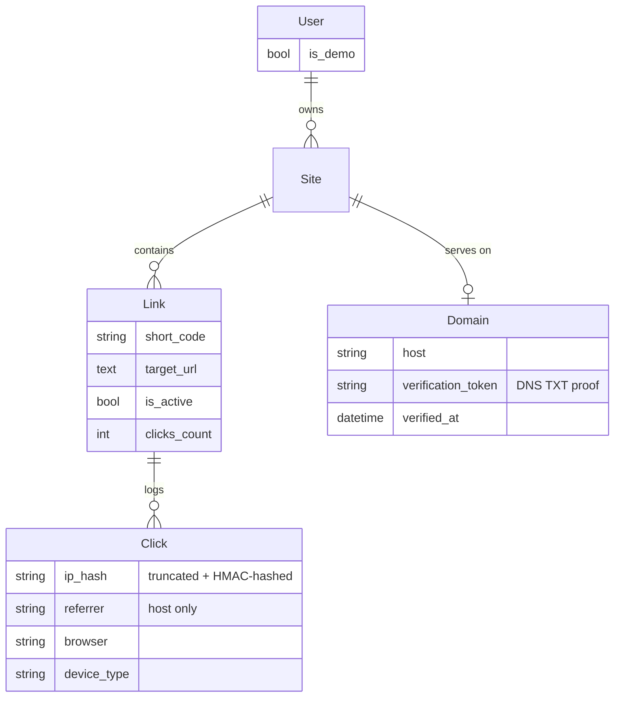
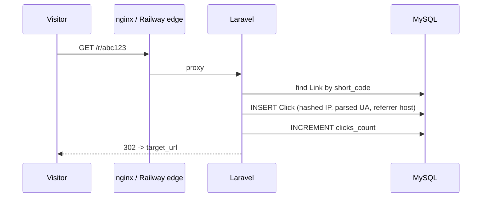

# LinkFleet

[](https://github.com/Aberfort/linkfleet/actions/workflows/ci.yml)
[](LICENSE)

A self-hosted redirect-link manager with click analytics — group your links by site, get a short `/r/{code}` URL for each one, and see who's clicking from where.

**Live demo:** https://linkfleet.xyz
**Demo login:** `demo@linkfleet.app` / `demo12345` (read-only — see [Demo account](#demo-account) below)

---

## What it does

- **Multi-tenant**: every user only ever sees their own sites and links, enforced by Laravel Policies, not just hidden in the UI.
- **Real redirects**: `GET /r/{code}` is an actual `302` to the link's target URL — not just a stored value nobody reads.
- **Click analytics**: every redirect logs a click (timestamp, referrer host, browser/device — parsed locally, no external APIs) and the dashboard shows a 30-day time series plus referrer/browser/device breakdowns.
- **Privacy by default**: visitor IPs are never stored raw. They're truncated to a /24 (IPv4) or /64 (IPv6) network and HMAC-hashed before being written to the database.
- **Vanity or auto-generated short codes**: leave the code blank and one is generated; or pick your own.
- **Expiring and password-protected links**: give a link a deadline (it answers `410 Gone` afterwards) or put a password gate in front of it — the click only counts once the visitor is through.
- **QR code per link**, generated on the fly and public, so it can be embedded straight into a page or a printout.
- **CSV import** for moving a batch of links in at once, with per-row errors reported back instead of failing the whole file.
- **Custom domains**, verified by a DNS TXT record. Once verified, that host serves the site's links at the root — `go.example.com/summer-sale` — with the same click logging, expiry and password gate. See the [limitations](#honest-limitations) below for what's still missing.

## Architecture





## Tech stack

| | |
|---|---|
| Backend | Laravel 12 (PHP 8.2+), Sanctum (stateless bearer tokens), MySQL/SQLite |
| Frontend | React 18 + TypeScript, Vite, MUI, `@mui/x-charts` |
| Tests | PHPUnit (backend), Vitest + Testing Library (frontend) |
| CI | GitHub Actions — lint, type-check, tests, build, on every PR |
| Deploy | Docker, deployed on Railway (see [`backend/Dockerfile`](backend/Dockerfile) / [`frontend/Dockerfile`](frontend/Dockerfile)); a `docker-compose.yml` is also provided for fully self-hosted use |

## Demo account

The public demo logs in as a seeded, **read-only** account (`is_demo = true` — enforced server-side via a single `Gate::before()` hook, not just disabled buttons in the UI) so visitors can look around without being able to touch anyone else's data or spam the redirect endpoint. Self-registration is disabled on the public deployment for the same reason (`REGISTRATION_ENABLED=false`) — the registration form and endpoint are still fully implemented and covered by tests, just gated behind an env var.

## Running locally

Two things need to run: the Laravel API and the React frontend. SQLite needs zero setup, so that's the fastest path.

```bash
# backend
cd backend
cp .env.example .env
composer install
php artisan key:generate
touch database/database.sqlite
php artisan migrate --seed
php artisan serve
```

```bash
# frontend, in a separate terminal
cd frontend
cp .env.example .env   # VITE_API_URL=http://localhost:8000
npm install
npm run dev
```

Open http://localhost:3000 — log in with the seeded demo account above, or register your own (registration is open by default locally).

### Docker (self-hosted)

```bash
docker compose up --build
```

Brings up the backend, frontend, MySQL, nginx (reverse-proxying both under one port), Redis and Mailpit — the same images used for the Railway deploy, just orchestrated with your own database instead of a managed one. See [`docker-compose.yml`](docker-compose.yml).

## Running tests

```bash
cd backend && vendor/bin/phpunit
cd frontend && npx vitest run
```

Both run in CI on every push/PR — see [`.github/workflows/ci.yml`](.github/workflows/ci.yml).

## Project structure

```
backend/    Laravel 12 API (app/, database/migrations, tests/)
frontend/   React + TypeScript SPA (src/pages, src/api, src/contexts)
nginx/      Reverse proxy config for the self-hosted docker-compose setup
```

Each half also has its own README with more detail: [backend/README.md](backend/README.md), [frontend/README.md](frontend/README.md).

## Honest limitations

- No geolocation on clicks — deliberately out of scope (see [`app/Support/ClientIp.php`](backend/app/Support/ClientIp.php)'s comment): it would mean either a paid IP-geo API or bundling/hosting a GeoIP database, neither of which felt worth the added infrastructure for what this project is.
- Analytics window is a fixed 30 days; no custom date-range picker yet.
- No team/multi-user sites — a site has exactly one owner.
- Custom domains stop short of actually serving traffic: ownership verification and host-based routing are done and tested, but pointing the host at the app (A/CNAME) and issuing its TLS certificate are not. Related: `short_code` is still globally unique, so two sites can't both own `summer-sale` — scoping codes per domain is the follow-up once a domain can serve traffic.

## License

[MIT](LICENSE)
