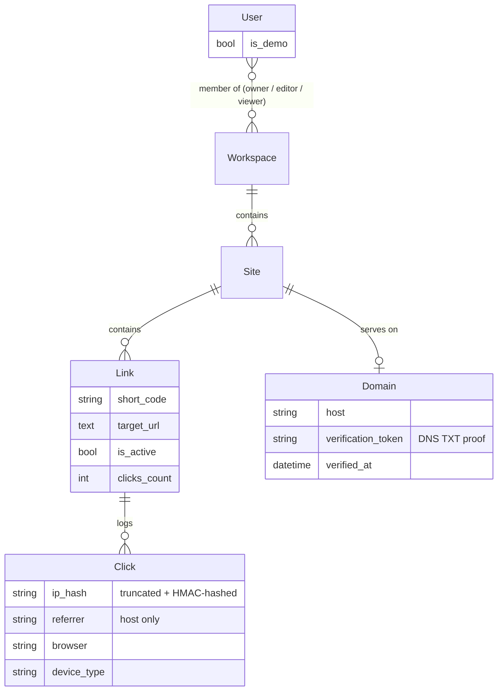
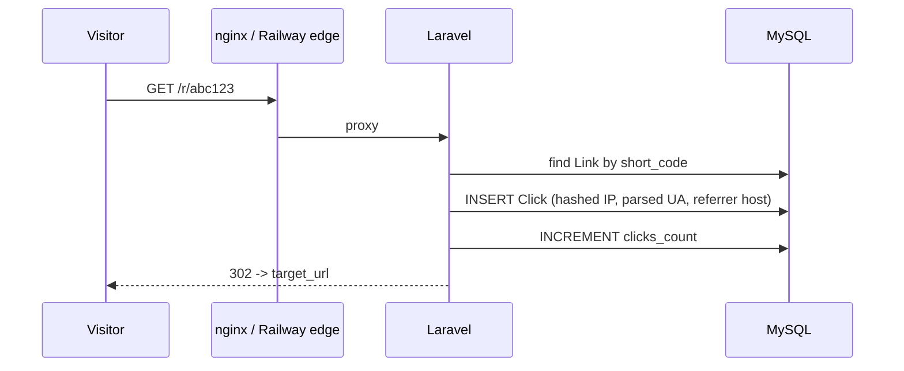

# LinkFleet

[](https://github.com/Aberfort/linkfleet/actions/workflows/ci.yml)
[](LICENSE)

A self-hosted redirect-link manager with click analytics — group your links by site, get a short `/r/{code}` URL for each one, and see who's clicking from where.

**Live demo:** https://linkfleet.xyz
**Demo login:** `demo@linkfleet.app` / `demo12345` (read-only — see [Demo account](#demo-account) below)

---

## What it does

- **Workspaces and roles**: sites live in a workspace, and a workspace has owners, editors and viewers — an agency can give each client a workspace and let them see only their own links. Enforced by Laravel Policies, not just hidden in the UI.
- **Real redirects**: `GET /r/{code}` is an actual `302` to the link's target URL — not just a stored value nobody reads.
- **Click analytics**: every redirect logs a click (timestamp, referrer host, browser/device — parsed locally, no external APIs) and the dashboard shows a time series plus referrer/browser/device breakdowns for any period up to a year, optionally set against the period before it, with a one-click CSV export.
- **Privacy by default**: visitor IPs are never stored raw. They're truncated to a /24 (IPv4) or /64 (IPv6) network and HMAC-hashed before being written to the database.
- **Vanity or auto-generated short codes**: leave the code blank and one is generated; or pick your own.
- **Expiring and password-protected links**: give a link a deadline (it answers `410 Gone` afterwards) or put a password gate in front of it — the click only counts once the visitor is through.
- **QR code per link**, generated on the fly and public, so it can be embedded straight into a page or a printout.
- **CSV import** for moving a batch of links in at once, with per-row errors reported back instead of failing the whole file.
- **API keys** for scripts and integrations: read-only or read-write, optionally pinned to a single workspace, throttled per key, and shown only once. The [API reference](docs/API.md) covers the rest.
- **Geography**: which countries the clicks come from, placed from a database on your own server — the address is used for the lookup and then forgotten, and only the country is kept.
- **Conversions**: turn a click into "how many bought". A destination site gets a `lf_click` token, reports back through a tiny snippet/pixel or — for revenue — a signed-in server call, and the dashboard shows conversions, rate and revenue per currency, per event and per link. Idempotent, attribution-windowed, and honest about which numbers come from a browser and can be forged.
- **Webhooks** for new links, edits, deletions and clicks: signed with HMAC-SHA256, retried with backoff, with a per-webhook delivery log. Because the server calls addresses users type in, the SSRF defence around them is built and tested against hostile inputs rather than assumed — see the [backend README](backend/README.md#webhooks).
- **Custom domains**, verified by a DNS TXT record. Once verified, that host serves the site's links at the root — `go.example.com/summer-sale` — with the same click logging, expiry and password gate, and copied links and QR codes switch to the branded address. The dashboard walks each domain through ownership → DNS → HTTPS and reports which step is still missing.

## Architecture


```mermaid
erDiagram
    User }o--o{ Workspace : "member of (owner / editor / viewer)"
    Workspace ||--o{ Site : contains
    Site ||--o{ Link : contains
    Site ||--o| Domain : "serves on"
    Link ||--o{ Click : logs

    User {
        bool is_demo
    }
    Domain {
        string host
        string verification_token "DNS TXT proof"
        datetime verified_at
    }
    Link {
        string short_code
        text target_url
        bool is_active
        int clicks_count
    }
    Click {
        string ip_hash "truncated + HMAC-hashed"
        string referrer "host only"
        string browser
        string device_type
    }
```


```mermaid
sequenceDiagram
    participant Visitor
    participant nginx as nginx / Railway edge
    participant Laravel
    participant DB as MySQL

    Visitor->>nginx: GET /r/abc123
    nginx->>Laravel: proxy
    Laravel->>DB: find Link by short_code
    Laravel->>DB: INSERT Click (hashed IP, parsed UA, referrer host)
    Laravel->>DB: INCREMENT clicks_count
    Laravel-->>Visitor: 302 -> target_url
```

## Tech stack

| | |
|---|---|
| Backend | Laravel 12 (PHP 8.2+), Sanctum (stateless bearer tokens), MySQL/SQLite |
| Frontend | React 18 + TypeScript, Vite, MUI, `@mui/x-charts` |
| Tests | PHPUnit (backend), Vitest + Testing Library (frontend) |
| CI | GitHub Actions — lint, type-check, tests, build, on every PR |
| Deploy | Docker, deployed on Railway (see [`backend/Dockerfile`](backend/Dockerfile) / [`frontend/Dockerfile`](frontend/Dockerfile)); a `docker-compose.yml` is also provided for fully self-hosted use |

## Demo account

The public demo logs in as a seeded, **read-only** account (`is_demo = true` — enforced server-side via a single `Gate::before()` hook, not just disabled buttons in the UI) so visitors can look around without being able to touch anyone else's data or spam the redirect endpoint. Self-registration is disabled on the public deployment for the same reason (`REGISTRATION_ENABLED=false`) — the registration form and endpoint are still fully implemented and covered by tests, just gated behind an env var.

## Running locally

Two things need to run: the Laravel API and the React frontend. SQLite needs zero setup, so that's the fastest path.

```bash
# backend
cd backend
cp .env.example .env
composer install
php artisan key:generate
touch database/database.sqlite
php artisan migrate --seed
php artisan serve
php artisan queue:work   # in another terminal: sends webhook deliveries
```

```bash
# frontend, in a separate terminal
cd frontend
cp .env.example .env   # VITE_API_URL=http://localhost:8000
npm install
npm run dev
```

Open http://localhost:3000 — log in with the seeded demo account above, or register your own (registration is open by default locally).

### Docker (self-hosted)

```bash
docker compose up --build
```

Brings up the backend, frontend, MySQL, nginx (reverse-proxying both under one port), Redis and Mailpit — the same images used for the Railway deploy, just orchestrated with your own database instead of a managed one. See [`docker-compose.yml`](docker-compose.yml).

## Running tests

```bash
cd backend && vendor/bin/phpunit
cd frontend && npx vitest run
```

Both run in CI on every push/PR — see [`.github/workflows/ci.yml`](.github/workflows/ci.yml).

## Project structure

```
backend/    Laravel 12 API (app/, database/migrations, tests/)
frontend/   React + TypeScript SPA (src/pages, src/api, src/contexts)
nginx/      Reverse proxy config for the self-hosted docker-compose setup
```

Each half also has its own README with more detail: [backend/README.md](backend/README.md), [frontend/README.md](frontend/README.md).

## Honest limitations

- Geography is country-level and approximate: IP geolocation is wrong for VPNs and mobile carriers, there is no city, and it is only as good as the free DB-IP file it uses (CC BY 4.0, credited on the dashboard).
- "Unique visitors" is approximate by design: IPs are truncated to a /24 and hashed, so it counts networks, not people.
- Webhooks are sent by a single queue worker by default and are never switched off automatically when an endpoint keeps failing; `link.deleted` is not sent per link when a whole site or workspace is deleted.
- Members are added by the email of an account that already exists; there are no emailed invitations (the public demo has no mail pipeline, and registration is closed there anyway).
- Custom domains are checked, not provisioned: LinkFleet verifies ownership and reports whether DNS and HTTPS are ready, but issuing the certificate and registering the host with the platform (a Railway custom domain, or a Caddy/nginx block on a VPS) is done outside the app. `short_code` is also still globally unique, so two sites can't both own `summer-sale`.

## License

[MIT](LICENSE)
